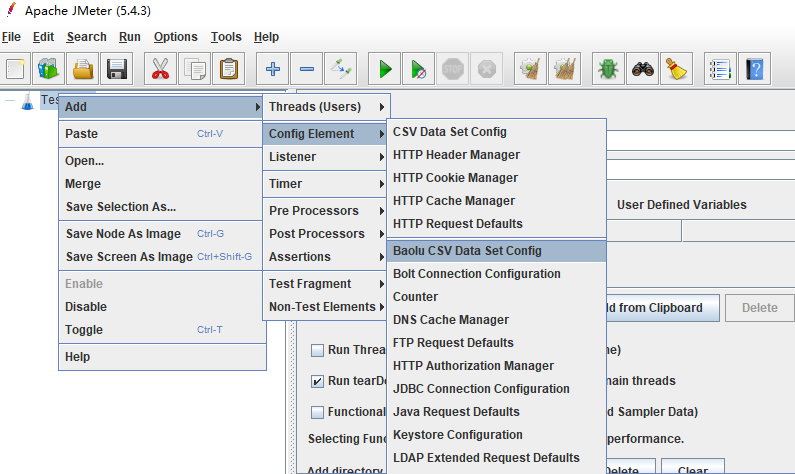
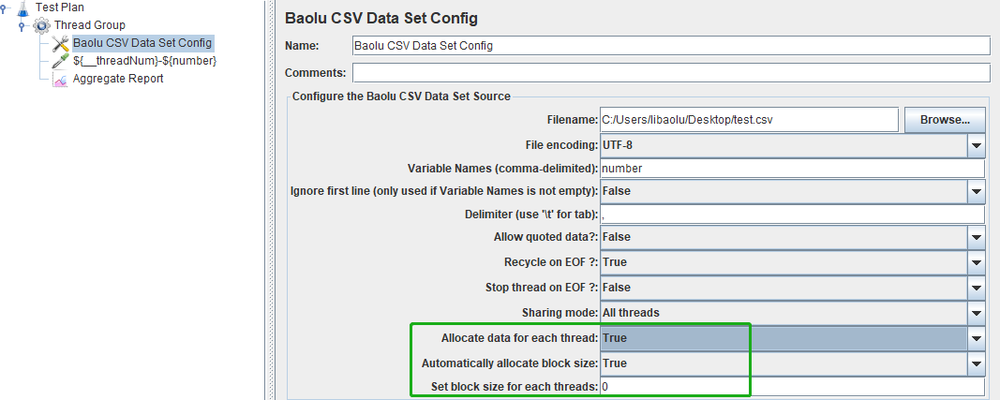
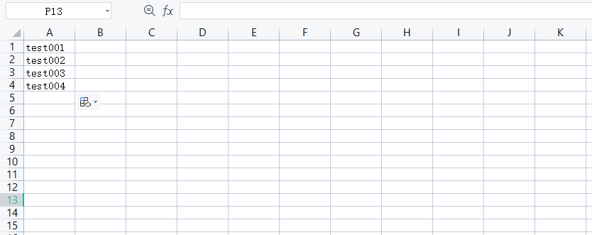
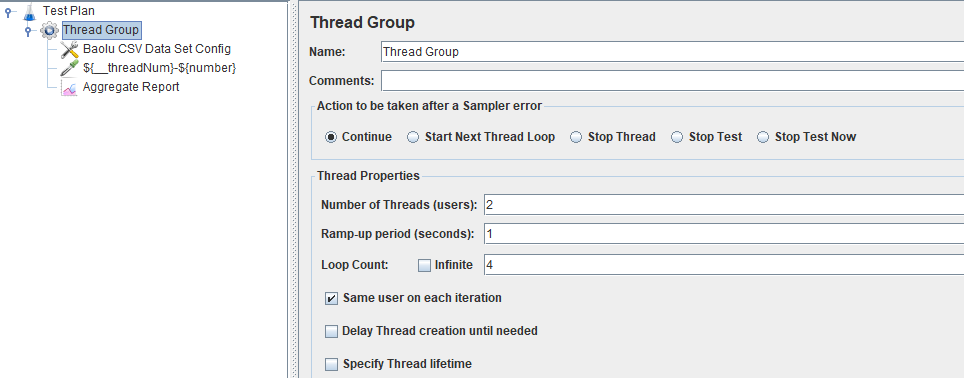
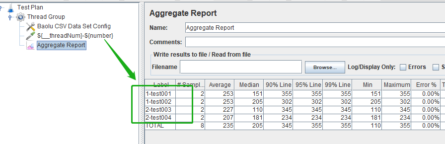

# baolu-csv-data-file-config

#### Description
This plug-in supports automatic or manual csv data allocation for each thread.

It has a similar LoadRunner capability parameterization.

#### Installation
This plug-in is developed based on JMeter's csv-data-file-config

You can download the latest version of baolu-csv-data-file-config from [here](https://gitee.com/LeeBaul/baolu-csv-data-file-config/releases)

or get in Download directory.

#### Build source code
You can clone the project and run 'mvn install'. 

Maven will download some JMeter dependency jar files, so the build time will up to your network status.

#### How to use this plug-in
1. Creat script add baolu-csv-data-file-config

2. Finally, the script structure is as follows

remarks:

Allocate data for each thread When it is true (default false), the parameterized file is partitioned by threads, and each thread is allocated with different block data.

Automatically allocate block size Only Allocate data for each thread set true.

Set block size for each threads Only Allocate data for each thread set true and automatically allocate block size set false.

In the script we set Allocate data for each thread is true also Automatically allocate block size is true.

There are four lines of data in the test csv file.

we set Thread Group like this:

3. we run this script now,give the result as follows.

we can see every thread automatically allocates two pieces of data. 

threadNum 1 will only read the first two data,threadNum 2 will only read the last two data.

4. You can also try manual csv data allocation for each thread now.

tips：

Allocate data for each thread set true && Automatically allocate block size set false && 

Set block size for each threads int value.

